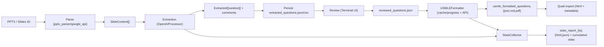

# QBank Parser Incremental Re-Architecture Plan (No Big-Bang Rewrite)

## 1) 1-page executive summary (what’s broken, why it hurts, biggest leverage points)

What’s broken:
- The runtime is effectively a monolith centered in [main.py](/Users/ahmadhajji/.gemini/antigravity/scratch/qbank-parser/main.py#L322) with orchestration, IO, API calls, concurrency, retry logic, state persistence, formatting, and UX all mixed.
- Core model ownership is misplaced: `ExtractedQuestion` lives in Gemini code ([ai/gemini_processor.py](/Users/ahmadhajji/.gemini/antigravity/scratch/qbank-parser/ai/gemini_processor.py#L32)) but is used by OpenAI extraction, export, review, and formatter.
- Provider/runtime drift is real: docs/env advertise Gemini-first behavior ([README.md](/Users/ahmadhajji/.gemini/antigravity/scratch/qbank-parser/README.md#L11), [.env.example](/Users/ahmadhajji/.gemini/antigravity/scratch/qbank-parser/.env.example#L4)), while extraction and formatter paths are OpenAI-focused in practice ([main.py](/Users/ahmadhajji/.gemini/antigravity/scratch/qbank-parser/main.py#L398), [main.py](/Users/ahmadhajji/.gemini/antigravity/scratch/qbank-parser/main.py#L739)).
- There is avoidable duplication and coupling: placeholder image heuristics duplicated in parser and exporter ([parsers/pptx_parser.py](/Users/ahmadhajji/.gemini/antigravity/scratch/qbank-parser/parsers/pptx_parser.py#L156), [export/quail_export.py](/Users/ahmadhajji/.gemini/antigravity/scratch/qbank-parser/export/quail_export.py#L57)); stage handoff relies on filesystem artifacts instead of typed returns ([main.py](/Users/ahmadhajji/.gemini/antigravity/scratch/qbank-parser/main.py#L1038)).
- Dependency and packaging hygiene is weak: path hacks via `sys.path.insert` ([export/csv_export.py](/Users/ahmadhajji/.gemini/antigravity/scratch/qbank-parser/export/csv_export.py#L15), [review/terminal_ui.py](/Users/ahmadhajji/.gemini/antigravity/scratch/qbank-parser/review/terminal_ui.py#L31), [export/usmle_formatter.py](/Users/ahmadhajji/.gemini/antigravity/scratch/qbank-parser/export/usmle_formatter.py#L32)); missing runtime deps for PDF (`markdown2`, `playwright`) in requirements ([md_to_pdf.py](/Users/ahmadhajji/.gemini/antigravity/scratch/qbank-parser/md_to_pdf.py#L11), [requirements.txt](/Users/ahmadhajji/.gemini/antigravity/scratch/qbank-parser/requirements.txt#L1)).

Why it hurts:
- High regression risk for any change in `main.py`/formatter due to wide blast radius.
- Slow developer velocity: poor boundaries make small features require broad edits.
- Correctness risk from hidden side effects and mixed concerns.
- Test suite is green (`42 passed`) but mostly unit-level seams; low confidence on end-to-end invariants.

Biggest leverage points:
- Extract a stable domain + service boundaries first, keep CLI behavior unchanged.
- Move stage handoffs from “files as API” to typed in-memory contracts with explicit persistence adapters.
- Centralize shared algorithms (image filtering, question keying, JSON atomic writes).
- Add CI rails (format/lint/type/test) and integration tests around the real pipeline seams.

Current baseline verified:
- `pytest -q` => 42/42 passing.
- `python3 -m py_compile ...` across core modules => no compile errors.

---

## 2) Architecture map: modules/components/services, responsibilities, key data flows

### Components and responsibilities
- `Entry points`
  - [main.py](/Users/ahmadhajji/.gemini/antigravity/scratch/qbank-parser/main.py#L1146): CLI command routing and pipeline orchestration.
  - [gui_app.py](/Users/ahmadhajji/.gemini/antigravity/scratch/qbank-parser/gui_app.py#L22): desktop controller that shells out to CLI.
- `Parsing + ingest`
  - [parsers/pptx_parser.py](/Users/ahmadhajji/.gemini/antigravity/scratch/qbank-parser/parsers/pptx_parser.py#L216): slide text/notes/image extraction.
  - [parsers/google_api.py](/Users/ahmadhajji/.gemini/antigravity/scratch/qbank-parser/parsers/google_api.py#L251): Slides title/comments/export.
- `AI extraction/formatting`
  - [ai/openai_processor.py](/Users/ahmadhajji/.gemini/antigravity/scratch/qbank-parser/ai/openai_processor.py#L85): extraction (text/vision).
  - [export/usmle_formatter.py](/Users/ahmadhajji/.gemini/antigravity/scratch/qbank-parser/export/usmle_formatter.py#L246): USMLE transform + cache + retries + rate control.
- `Review/export`
  - [review/terminal_ui.py](/Users/ahmadhajji/.gemini/antigravity/scratch/qbank-parser/review/terminal_ui.py#L45): interactive review.
  - [export/csv_export.py](/Users/ahmadhajji/.gemini/antigravity/scratch/qbank-parser/export/csv_export.py#L48): extracted/reviewed JSON+CSV.
  - [export/quail_export.py](/Users/ahmadhajji/.gemini/antigravity/scratch/qbank-parser/export/quail_export.py#L278): Quail HTML/metadata export.
  - [md_to_pdf.py](/Users/ahmadhajji/.gemini/antigravity/scratch/qbank-parser/md_to_pdf.py#L18): markdown-to-PDF.
- `Stats + config`
  - [stats/collector.py](/Users/ahmadhajji/.gemini/antigravity/scratch/qbank-parser/stats/collector.py#L114): run-time stats singleton.
  - [stats/report_generator.py](/Users/ahmadhajji/.gemini/antigravity/scratch/qbank-parser/stats/report_generator.py#L38): HTML report generation.
  - [config.py](/Users/ahmadhajji/.gemini/antigravity/scratch/qbank-parser/config.py#L24): env loading + filesystem side effects.

### Key data flows


---

## 3) Pain inventory: top 10 messes (with file/dir references)

1. God-orchestrator file with mixed responsibilities and large mutable scope.
   - [main.py](/Users/ahmadhajji/.gemini/antigravity/scratch/qbank-parser/main.py#L322)
2. Formatter is a second god module (provider adapters, schema, caching, retries, scheduler in one class).
   - [export/usmle_formatter.py](/Users/ahmadhajji/.gemini/antigravity/scratch/qbank-parser/export/usmle_formatter.py#L246), [export/usmle_formatter.py](/Users/ahmadhajji/.gemini/antigravity/scratch/qbank-parser/export/usmle_formatter.py#L776)
3. Core domain model anchored to provider-specific module (`ExtractedQuestion` under Gemini).
   - [ai/gemini_processor.py](/Users/ahmadhajji/.gemini/antigravity/scratch/qbank-parser/ai/gemini_processor.py#L32), [ai/openai_processor.py](/Users/ahmadhajji/.gemini/antigravity/scratch/qbank-parser/ai/openai_processor.py#L18)
4. Import-path hacks indicate packaging/module-boundary fragility.
   - [export/csv_export.py](/Users/ahmadhajji/.gemini/antigravity/scratch/qbank-parser/export/csv_export.py#L15), [review/terminal_ui.py](/Users/ahmadhajji/.gemini/antigravity/scratch/qbank-parser/review/terminal_ui.py#L31), [export/usmle_formatter.py](/Users/ahmadhajji/.gemini/antigravity/scratch/qbank-parser/export/usmle_formatter.py#L32)
5. Docs/config drift from runtime truth (Gemini vs OpenAI behavior).
   - [README.md](/Users/ahmadhajji/.gemini/antigravity/scratch/qbank-parser/README.md#L11), [README.md](/Users/ahmadhajji/.gemini/antigravity/scratch/qbank-parser/README.md#L113), [main.py](/Users/ahmadhajji/.gemini/antigravity/scratch/qbank-parser/main.py#L739), [.env.example](/Users/ahmadhajji/.gemini/antigravity/scratch/qbank-parser/.env.example#L4)
6. Hidden side effects on import (mkdir/env mutation) reduce testability and predictability.
   - [config.py](/Users/ahmadhajji/.gemini/antigravity/scratch/qbank-parser/config.py#L30), [config.py](/Users/ahmadhajji/.gemini/antigravity/scratch/qbank-parser/config.py#L60)
7. File-based coupling between pipeline stages instead of explicit typed interfaces.
   - [main.py](/Users/ahmadhajji/.gemini/antigravity/scratch/qbank-parser/main.py#L1038), [main.py](/Users/ahmadhajji/.gemini/antigravity/scratch/qbank-parser/main.py#L1060)
8. Duplicated placeholder-image filtering logic with divergent behavior risk.
   - [parsers/pptx_parser.py](/Users/ahmadhajji/.gemini/antigravity/scratch/qbank-parser/parsers/pptx_parser.py#L156), [export/quail_export.py](/Users/ahmadhajji/.gemini/antigravity/scratch/qbank-parser/export/quail_export.py#L57)
9. Global singleton state for stats creates hidden dependencies.
   - [stats/collector.py](/Users/ahmadhajji/.gemini/antigravity/scratch/qbank-parser/stats/collector.py#L348)
10. Missing dependency declarations for PDF path plus sparse end-to-end coverage.
   - [md_to_pdf.py](/Users/ahmadhajji/.gemini/antigravity/scratch/qbank-parser/md_to_pdf.py#L11), [requirements.txt](/Users/ahmadhajji/.gemini/antigravity/scratch/qbank-parser/requirements.txt#L1), [tests](/Users/ahmadhajji/.gemini/antigravity/scratch/qbank-parser/tests)

---

## 4) Quick wins (1–3 days) that reduce risk immediately

1. Align runtime contract docs with reality.
   - Update [README.md](/Users/ahmadhajji/.gemini/antigravity/scratch/qbank-parser/README.md) and [.env.example](/Users/ahmadhajji/.gemini/antigravity/scratch/qbank-parser/.env.example) to reflect OpenAI-required extraction/formatter path and current flags.
2. Fix dependency gap for PDF generation.
   - Add missing deps for [md_to_pdf.py](/Users/ahmadhajji/.gemini/antigravity/scratch/qbank-parser/md_to_pdf.py#L11) and make PDF export optional with clear fallback messaging.
3. Remove import-time path hacks.
   - Replace `sys.path.insert` usage in [export/csv_export.py](/Users/ahmadhajji/.gemini/antigravity/scratch/qbank-parser/export/csv_export.py#L15), [review/terminal_ui.py](/Users/ahmadhajji/.gemini/antigravity/scratch/qbank-parser/review/terminal_ui.py#L31), [export/usmle_formatter.py](/Users/ahmadhajji/.gemini/antigravity/scratch/qbank-parser/export/usmle_formatter.py#L32) with package-relative imports.
4. Add a minimal integration smoke test.
   - New test executes parse->export on a tiny fixture with mocked API clients to lock pipeline contract.
5. Centralize `question_key` helper in one module.
   - Deduplicate logic in [main.py](/Users/ahmadhajji/.gemini/antigravity/scratch/qbank-parser/main.py#L120) and [export/csv_export.py](/Users/ahmadhajji/.gemini/antigravity/scratch/qbank-parser/export/csv_export.py#L20).

---

## 5) Refactor roadmap (2–6 weeks): ordered PR-sized steps

### Public APIs/interfaces/types changes (minimal and backward-compatible)
- Introduce `domain/models.py` with canonical `ExtractedQuestion`, `SlideContent`, `USMLEQuestion` types.
- Add `PipelineResult` and `RunContext` dataclasses for internal stage contracts.
- Keep CLI flags and output filenames stable for this roadmap.
- Keep temporary re-export shims so old imports still resolve during migration.

### PR1 (Week 1): Extract domain model package
objective: Move shared dataclasses out of provider modules to a neutral domain layer.  
exact files/areas touched: new `domain/models.py`; update [ai/gemini_processor.py](/Users/ahmadhajji/.gemini/antigravity/scratch/qbank-parser/ai/gemini_processor.py), [ai/openai_processor.py](/Users/ahmadhajji/.gemini/antigravity/scratch/qbank-parser/ai/openai_processor.py), [export/csv_export.py](/Users/ahmadhajji/.gemini/antigravity/scratch/qbank-parser/export/csv_export.py), [export/usmle_formatter.py](/Users/ahmadhajji/.gemini/antigravity/scratch/qbank-parser/export/usmle_formatter.py), [review/terminal_ui.py](/Users/ahmadhajji/.gemini/antigravity/scratch/qbank-parser/review/terminal_ui.py), [main.py](/Users/ahmadhajji/.gemini/antigravity/scratch/qbank-parser/main.py).  
refactor pattern: extract module + compatibility adapter.  
tests to add/expand: model serde round-trip; import-compat tests for old paths.  
verification (commands to run): `pytest -q`; `python3 -m py_compile $(rg --files -g '*.py')`.  
rollback plan: keep old definitions and alias imports until all callers are switched.

### PR2 (Week 1): Introduce application services around extraction
objective: Split extraction orchestration from CLI presentation code.  
exact files/areas touched: new `app/extraction_service.py`, `app/status_service.py`; slim [main.py](/Users/ahmadhajji/.gemini/antigravity/scratch/qbank-parser/main.py#L322).  
refactor pattern: strangler fig around `parse_presentation`.  
tests to add/expand: service-level tests for resume compatibility, checkpointing, and Google comments branch.  
verification (commands to run): `pytest -q tests/test_progress_scope.py tests/test_google_slides_id_override.py`; `pytest -q`.  
rollback plan: retain old `parse_presentation` wrapper calling old code path behind feature flag.

### PR3 (Week 2): Introduce storage boundary for pipeline artifacts
objective: Replace implicit file coupling with explicit repository methods.  
exact files/areas touched: new `storage/run_repository.py`; adapt [main.py](/Users/ahmadhajji/.gemini/antigravity/scratch/qbank-parser/main.py#L1038), [export/csv_export.py](/Users/ahmadhajji/.gemini/antigravity/scratch/qbank-parser/export/csv_export.py), [export/usmle_formatter.py](/Users/ahmadhajji/.gemini/antigravity/scratch/qbank-parser/export/usmle_formatter.py#L857).  
refactor pattern: boundary + repository adapter.  
tests to add/expand: atomic-write/recovery tests; serialized schema contract tests.  
verification (commands to run): `pytest -q tests/test_export_metadata.py tests/test_review_keying.py`; `pytest -q`.  
rollback plan: repository methods delegate to existing file functions; switch by config flag.

### PR4 (Week 2): Isolate provider adapters
objective: Decouple provider protocol from pipeline orchestration and remove mixed-provider branches from core logic.  
exact files/areas touched: new `providers/extraction/openai_adapter.py`, `providers/formatter/openai_adapter.py`; trim [ai/openai_processor.py](/Users/ahmadhajji/.gemini/antigravity/scratch/qbank-parser/ai/openai_processor.py) and [export/usmle_formatter.py](/Users/ahmadhajji/.gemini/antigravity/scratch/qbank-parser/export/usmle_formatter.py#L249).  
refactor pattern: adapter + anti-corruption boundary.  
tests to add/expand: request payload snapshot tests; error-classification tests (`429`, model access).  
verification (commands to run): `pytest -q tests/test_openai_formatter_provider.py tests/test_usmle_formatter_schema.py`; `pytest -q`.  
rollback plan: leave old class constructors as facades over adapters.

### PR5 (Week 3): Consolidate image filtering and key helpers
objective: Remove duplicated heuristics and guarantee same behavior in parse/export stages.  
exact files/areas touched: new `utils/image_filters.py`, new `utils/question_keys.py`; update [parsers/pptx_parser.py](/Users/ahmadhajji/.gemini/antigravity/scratch/qbank-parser/parsers/pptx_parser.py#L156), [export/quail_export.py](/Users/ahmadhajji/.gemini/antigravity/scratch/qbank-parser/export/quail_export.py#L57), [main.py](/Users/ahmadhajji/.gemini/antigravity/scratch/qbank-parser/main.py#L120), [export/csv_export.py](/Users/ahmadhajji/.gemini/antigravity/scratch/qbank-parser/export/csv_export.py#L20).  
refactor pattern: extract utility.  
tests to add/expand: parity tests to ensure old/new image filtering outputs match on fixture set.  
verification (commands to run): `pytest -q tests/test_pptx_placeholder_filter.py tests/test_quail_export.py tests/test_review_keying.py`.  
rollback plan: keep old functions as wrappers to new utils.

### PR6 (Week 4): Decompose formatter orchestration
objective: Split [export/usmle_formatter.py](/Users/ahmadhajji/.gemini/antigravity/scratch/qbank-parser/export/usmle_formatter.py#L776) into focused units: prompting, response parsing, caching/progress, scheduler.  
exact files/areas touched: new `formatting/prompt_builder.py`, `formatting/response_parser.py`, `formatting/cache_store.py`, `formatting/scheduler.py`; lightweight facade in existing formatter module.  
refactor pattern: extract class/module with compatibility facade.  
tests to add/expand: cache-hit/miss contract tests; duplicate-ID rejection; retry/backpressure determinism tests with fake clock.  
verification (commands to run): `pytest -q tests/test_usmle_formatter_schema.py tests/test_usmle_question_ids.py`; `pytest -q`.  
rollback plan: keep old single-file class path and gate new scheduler with flag.

### PR7 (Week 5): Quality rails + CI gates
objective: Add enforceable guardrails for style, typing, and regression checks.  
exact files/areas touched: new `pyproject.toml`, `.ruff.toml`, `mypy.ini`, `pytest.ini`, `.github/workflows/ci.yml`, `requirements-dev.txt`; update imports in core modules.  
refactor pattern: boundary hardening.  
tests to add/expand: CI pipeline checks plus smoke integration tests.  
verification (commands to run): `ruff check .`; `ruff format --check .`; `mypy main.py ai export parsers review stats`; `pytest -q`.  
rollback plan: start with non-blocking CI warnings, then ratchet to required checks after 1 week green.

### PR8 (Week 6): Docs and operability completion
objective: Make architecture and runbook explicit; remove ambiguity from onboarding and maintenance.  
exact files/areas touched: [README.md](/Users/ahmadhajji/.gemini/antigravity/scratch/qbank-parser/README.md), new `docs/architecture.md`, `docs/adr/`, `docs/runbooks/pipeline.md`, `docs/testing.md`.  
refactor pattern: docs-as-contract.  
tests to add/expand: command examples validated by smoke script.  
verification (commands to run): `pytest -q`; `python3 main.py --help`; docs link checker (if added).  
rollback plan: docs-only PRs are trivially reversible.

Behavior-preservation proof strategy across roadmap:
- Keep CLI signatures stable in [main.py](/Users/ahmadhajji/.gemini/antigravity/scratch/qbank-parser/main.py#L1146).
- Golden fixtures for extraction/formatting outputs (semantic fields, not brittle text formatting).
- Before/after diff checks on `question_id`, `choices`, `correct_answer`, tag fields, and Quail numbering.
- Integration tests around resume (`extraction_progress.json`) and two-input merge path.

---

## 6) Performance pass: likely hot paths + profiling plan + low-risk optimizations

Likely hot paths:
- Slide extraction + image filtering loops in [parsers/pptx_parser.py](/Users/ahmadhajji/.gemini/antigravity/scratch/qbank-parser/parsers/pptx_parser.py#L125).
- OpenAI request serialization/base64 image conversion in [ai/openai_processor.py](/Users/ahmadhajji/.gemini/antigravity/scratch/qbank-parser/ai/openai_processor.py#L141).
- Formatter scheduling/backpressure loop in [export/usmle_formatter.py](/Users/ahmadhajji/.gemini/antigravity/scratch/qbank-parser/export/usmle_formatter.py#L914).
- Large HTML string construction in [stats/report_generator.py](/Users/ahmadhajji/.gemini/antigravity/scratch/qbank-parser/stats/report_generator.py#L38).

Profiling plan:
1. Add stage-level timing + counters around parse/extract/format/export boundaries.
2. Run `python3 -m cProfile -o profile.out main.py <fixture.pptx> --speed-profile balanced`.
3. Use `pstats` to rank cumulative time and call counts.
4. For API-bound runs, compare “wall time per successful question” and “retry-adjusted throughput”.

Low-risk optimizations:
- Replace per-pixel Python loops with downsample + histogram checks in shared image filter utility.
- Cache base64 image payload per file `path+mtime` in extraction retries.
- Avoid repeated full-list sort at each checkpoint; maintain deterministic append order and sort once at finalize.
- Precompute and reuse question keys/hashes where repeated.
- Keep adaptive concurrency but cap aggressive backoff oscillation in formatter scheduler.

---

## 7) Quality rails: lint/format/type checks, CI gates, conventions, folder structure proposal

Quality rails to enforce:
- Formatting: `ruff format`.
- Linting: `ruff check` (imports, complexity, dead code, bugbear).
- Typing: `mypy` for `app/`, `providers/`, `storage/`, `domain/`; gradual typing for legacy modules.
- Tests: `pytest -q` required on PR.
- CI gates: run format-check, lint, type-check, tests on every PR; no direct pushes to default branch.

Conventions:
- No `sys.path` manipulation.
- No side effects in config imports; move side effects behind explicit init methods.
- Keep dataclasses in `domain/` only.
- Stage functions should return typed results and explicit errors, not rely on implicit filesystem state.
- New modules must include focused unit tests and one integration path test.

Proposed folder structure:
```text
qbank-parser/
  app/
    extraction_service.py
    formatting_service.py
    workflow_service.py
  domain/
    models.py
    errors.py
  providers/
    extraction/openai_adapter.py
    formatting/openai_adapter.py
  storage/
    run_repository.py
    cache_store.py
  parsers/
  export/
  review/
  stats/
  utils/
  tests/
    unit/
    integration/
    fixtures/
```

---

## 8) Documentation plan: what to document and where

- `README`:
  - Accurate provider/runtime behavior and required env vars.
  - Supported workflows and failure handling.
  - Explicit “optional vs required” dependencies.
- `docs/architecture.md`:
  - Component boundaries, data contracts, and sequence diagrams.
- `docs/adr/`:
  - ADR-001: Domain model extraction.
  - ADR-002: File repository boundary.
  - ADR-003: Provider adapter strategy.
  - ADR-004: CI quality gates policy.
- `docs/runbooks/pipeline.md`:
  - Resume/recovery steps, partial output handling, rollback playbook.
- `docs/testing.md`:
  - Fixture strategy, golden-data policy, and non-flaky integration test patterns.

---

## 9) Questions for me (only if truly blocking; otherwise proceed with reasonable defaults)

No blocking questions. Proceeding defaults:
- Keep CLI interface backward-compatible throughout the refactor.
- Defer Gemini runtime removal until OpenAI path is fully modularized and documented.
- Prioritize correctness + testability over cosmetic style changes.
- Keep changes incremental, one concern per PR, each reversible.

Assumptions and unknowns called out:
- Unknown: production deck sizes/throughput SLOs and failure-rate tolerance.
- Unknown: whether Gemini path must remain first-class or legacy-only.
- Default assumption: maintain current behavior and artifacts while improving internals, then tighten contracts via tests before any behavioral changes.
